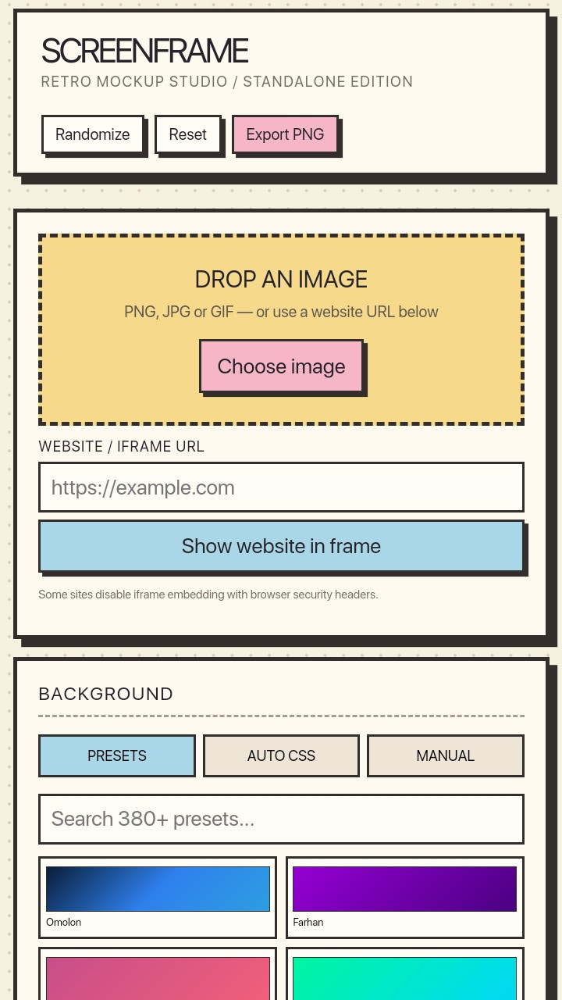
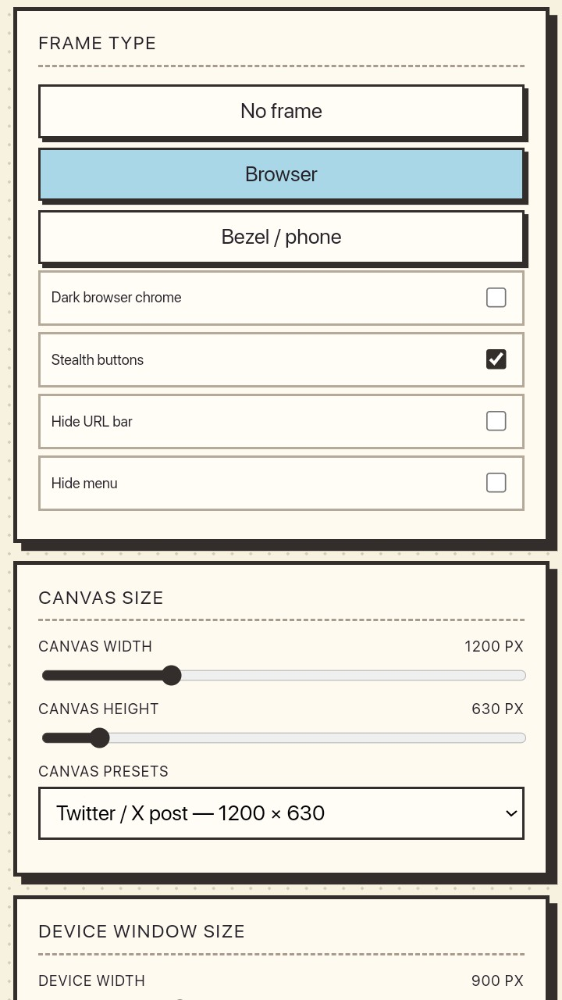
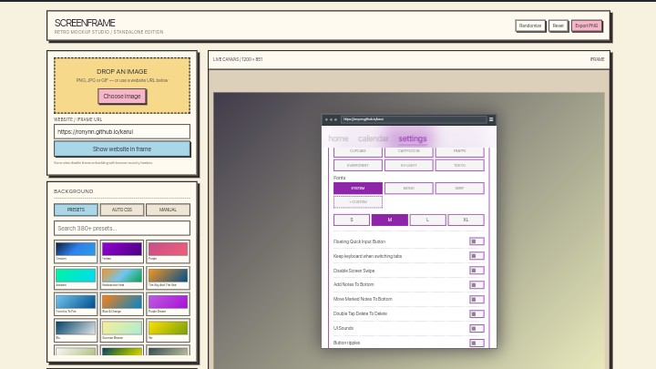

ScreenFrame enables you to display your screenshots and images as if in a desktop background or with phone bezels for a unique eyecatching look.

### Features 

- Prebuilt gradient picks
- Shadow picker
- Device wrappers

  
  

ScreenFrame is a vanilla rewrite of Mokkup which is a React application for glowing up images, for social media or your portfolio.

### Original Tech Stack

- React
- TypeScript
- Chakra UI
- Jest

ScreenFrame is being developed under the GPL v3 License.

Join us in our [telegram](https://t.me/karuiFOSS) or on discord, reddit.

Give this project a 🌟 if you liked it.